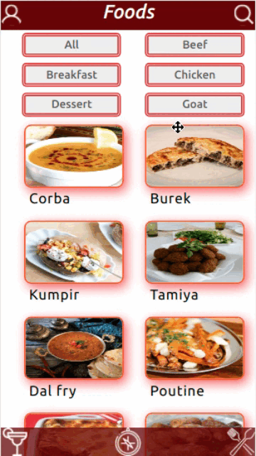

### Observação

Este repositório contem o **Projeto APP de Receitas** que reúne o aprendizado desenvolvido por _[Willian Alves Batista](https://www.linkedin.com/in/willian-alves-batista-60aa6a180/)_ enquanto estudante da [Trybe](https://www.betrybe.com/) :rocket:
**GitHub [Trybe](https://github.com/tryber)**.

# Projeto APP de Receitas

### Resultado obtido:

#### Habilidades que foram exigidas:

  - Fazer requisições e consumir dados vindos de uma `API`;
  - Utilizar os ciclos de vida de um componente React;
  - Utilizar o Switch e React Router;
  - Utilizar a Context API do React para gerenciar estado;
  - Utilizar o React Hook useState;
  - Utilizar o React Hook useContext;
  - Utilizar o React Hook useEffect;
  - Criar Hooks customizados.

---

## Apresentação do Projeto

### Introdução

O Projeto APP de Receitas, denominado de Uai Foods é uma aplicação web para mobile e tem como objetivo ser um site de receitas onde o usuário pode pesquisar por receitas de comidas ou drinks e terá acesso aos ingredientes e forma de preparo dos mesmos, seja por descrição em texto ou vídeo demonstrativo. Nesse projeto, foram utilizadas as seguintes tecnologias: React Hooks, a criação de Hooks customizadas, React Router Dom, Bootstrap e também dados de duas api, [The Meal db](https://www.themealdb.com/) e [The Cocktail db](https://www.thecocktaildb.com/api.php). Esse Projeto é a maior e mais complexa aplicação web feita até o presente momento, é o projeto que consolida todo meu conhecimento em Front-end, de estrutura semelhante a um TCC. E a realização do mesmo só foi possível em conjunto com outros desenvolvedores.

### Inicialização

  - git clone git@github.com:willianbatist/project-app-recipes.git;
  
  - entrar no diretorio do projeto;

  - npm install, para instalar os pacotes necessarios para o funcionamento;

  - npm start, para inicializar.

### 3. Tela Principal

  Depois do login, vem a tela principal que é composta por uma header, que possui navegação para a página de perfil e lupa de pesquisa, onde o usuário poderá pesquisar receitas por nome, ingredientes ou pela primeira letra do nome do prato ou drink. Ainda na parte de cima da tela temos os botões de filtro de pesquisa por categoria, onde só renderiza refeições ou drinks da categoria escolhida. No corpo do tela principal é o espaço que renderiza card das receitas, inicialmente são 12 receitas e muda de acordo com a pesquisa do usuário. Na parte inferior da tela está o footer, que permite a navegação entre telas de comidas e bebidas, e a tela de exploração que permite ao usuário explorar receitas, seja por nacionalidade ou ingredientes.

### 3.1 Tela de Detalhes da Receita

Ao clicar em alguma receita de sua preferência o usuário é redirecionado a página de detalhes da receita, nesse momento apresenta-se na tela a foto, nome, categoria, ingredientes, vídeo e descrição da receita. O usuário tem a opção de dar start, o que dará a possibilidade dele marcar as etapas da receita já concluídas. Nesse momento, tudo é salvo no localStorage, o que permite que a pessoa possa continuar depois se assim preferir. Assim que terminar, poderá clicar em finish, o que salvará em receitas finalizadas, assim podendo ter um histórico de receitas já feitas pelo usuário.

### Conclusão

O Projeto APP de Receitas ainda está em desenvolvimento e recebendo melhorias. Esse projeto foi realizado em grupo, com a colaboração de [João Vitor](https://www.linkedin.com/in/joaokeuwe/), [Caio Oliveira](https://github.com/caioliveira-dev), [Lucas Junqueira](https://github.com/lucaadev), [Juliane Alves](https://github.com/Juliane-Alves) e para organizar as tarefas em uma equipe foi necessário aplicar uma metodologia ágil, o kanban. Pequenas partes estão sendo entregues para que possa receber feedback e sofrer melhorias mais rápidas, assim podemos entender se estamos indo no caminho certo ou não. O desafio de realizar esse projeto me ajudou a alavancar minhas hard skills de ReactJS, melhorar consideravelmente minha lógica de programação e entender muito bem como uma metodologia ágil contribui numa equipe de desenvolvedores.
  
---
### Trybe

_"A Trybe é uma escola do futuro para qualquer pessoa que queira melhorar de vida e construir uma carreira de sucesso em tecnologia, onde a pessoa só paga quando conseguir um bom trabalho."_
